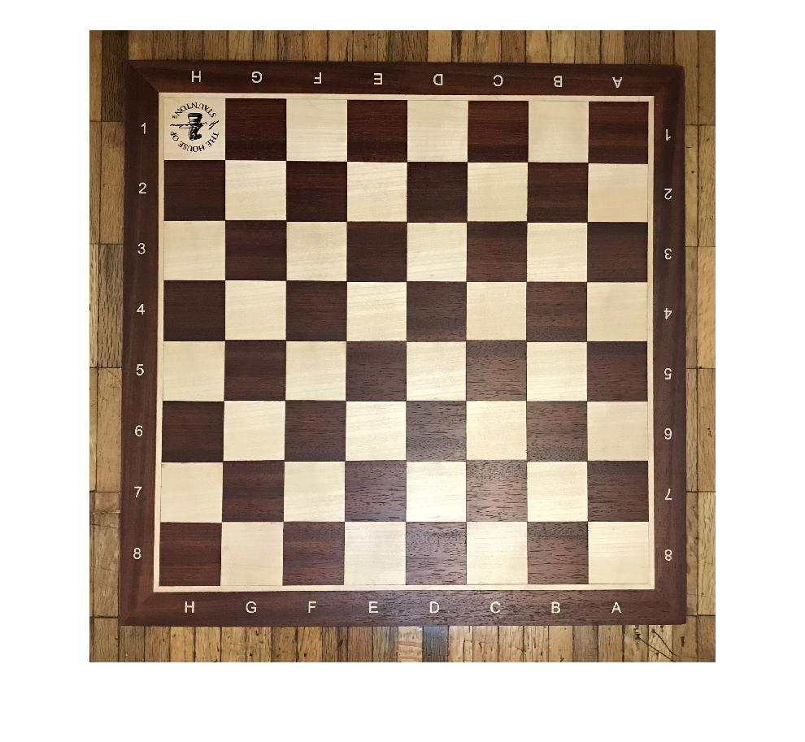

# Geometric-transformation
This repo provides a script to see an image A from the perspective of B image

## dependencies
- python 3.6
- opencv 3.4.2
- numpy 1.14.3

## How to use
- Clone this repo
- Place your "a.jpg" and "b.jpg" in the same folder
- Run `python3 index.py`
- Select 4 points on image A and 4 points on image B in the same order
- Wait for the result

## Example

### Input
    <!-- insert a table of two columns -->
    | A | B |
    |---|---|
    |  |  |

### Output

    
    | |
    ||
    |  |

## License
MIT

## Author
@kiqecanijo

